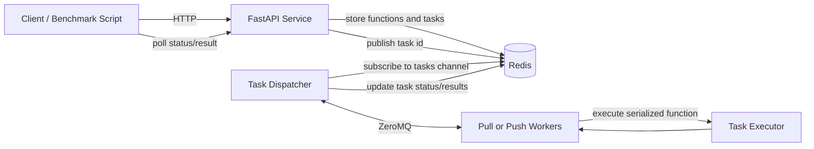

# Distributed Function-as-a-Service Platform

A distributed Function-as-a-Service (FaaS) platform built with **Python, FastAPI, Redis, ZeroMQ, Dill, and multiprocessing**. The system lets clients register Python functions, submit asynchronous invocations through REST APIs, track task status, and retrieve serialized results.

The platform supports three execution modes—**Local**, **Pull**, and **Push**—to compare different scheduling models. Redis stores registered functions, task metadata, status transitions, results, worker heartbeats, and task notifications. ZeroMQ coordinates communication between the dispatcher and distributed workers, while heartbeat monitoring and task re-queuing provide basic failure recovery.

> Built for MPCS 52040 Distributed Systems.

---

## Highlights

- **Python function registration** through a FastAPI REST service.
- **Asynchronous invocation** with task IDs returned immediately after submission.
- **Task status tracking** through Redis-backed state transitions.
- **Serialized result retrieval** using Dill and base64 encoding.
- **Three execution modes**:
  - **Local mode** — dispatcher executes tasks with a local multiprocessing pool.
  - **Pull mode** — workers request tasks from the dispatcher when ready.
  - **Push mode** — dispatcher assigns queued tasks to registered workers.
- **ZeroMQ-based worker-dispatcher coordination** using REQ/REP for Pull mode and ROUTER/DEALER for Push mode.
- **Heartbeat-based failure detection** for worker liveness monitoring.
- **Task re-queuing** when a worker fails before completing assigned work.
- **Benchmark tooling** for throughput, latency, weak-scaling, and execution-mode comparisons.
- **Pytest coverage** for API behavior, state transitions, dispatcher-worker integration, concurrency, and recovery behavior.

---

## Tech Stack

| Category | Technologies | Role |
|---|---|---|
| Web API | FastAPI, Uvicorn, REST APIs | Exposes function registration, task invocation, status polling, and result retrieval endpoints |
| State store | Redis | Stores function payloads, task metadata, task status, results, worker heartbeats, and task notifications |
| Messaging / coordination | Redis Pub/Sub, ZeroMQ | Redis notifies the dispatcher of new tasks; ZeroMQ coordinates dispatcher-worker communication |
| Serialization | Dill, base64 | Serializes Python functions, arguments, return values, and exceptions |
| Execution | multiprocessing, worker pools | Executes tasks locally or inside worker-side process/thread pools |
| Testing | pytest | Validates API behavior, dispatcher/worker flows, concurrency, and fault recovery |
| Benchmarking | requests, pandas, matplotlib | Measures latency, throughput, and scaling behavior across execution modes |

---

## Architecture

The platform is organized around four main components:



### Component Responsibilities

| Component | Responsibility |
|---|---|
| `service/main.py` | Defines REST endpoints for registering functions, submitting tasks, checking status, and retrieving results |
| `service/redis_client.py` | Stores registered functions, task records, statuses, results, worker heartbeats, and task notifications in Redis |
| `service/serialize.py` | Serializes and deserializes Python objects using Dill and base64 |
| `task_dispatcher.py` | Subscribes to new-task notifications and dispatches tasks in Local, Pull, or Push mode |
| `worker_pool/pull_worker.py` | Pull-mode worker that requests tasks from the dispatcher |
| `worker_pool/push_worker.py` | Push-mode worker that registers with the dispatcher and waits for assigned tasks |
| `worker_pool/executor.py` | Deserializes function payloads, executes functions, and serializes outputs or exceptions |
| `benchmark/performance_client.py` | Runs benchmark sweeps across execution modes, worker counts, and test functions |
| `benchmark/plot_results.py` | Generates benchmark plots from CSV output |

---

## Execution Modes

### Local Mode

Local mode runs tasks inside the dispatcher process using a local multiprocessing pool.

Use this mode to test the FastAPI service, Redis task state, serialization logic, and task lifecycle without launching separate workers.

```bash
python task_dispatcher.py -m local -w 4
```

### Pull Mode

Pull mode uses a ZeroMQ `REP` socket in the dispatcher and `REQ` sockets in workers. Workers repeatedly send `REQUEST_TASK` messages, receive a task when available, execute it, and return the result.

This mode is worker-driven: workers control when they request more work.

```bash
python task_dispatcher.py -m pull -p 5001
python -m worker_pool.pull_worker -H localhost -p 5001 -w 2
```

### Push Mode

Push mode uses a ZeroMQ `ROUTER` socket in the dispatcher and `DEALER` sockets in workers. Workers register with the dispatcher, and the dispatcher assigns queued tasks to registered workers in round-robin order.

This mode is dispatcher-driven and is useful for comparing centralized scheduling against pull-based scheduling.

```bash
python task_dispatcher.py -m push -p 5002
python -m worker_pool.push_worker -H localhost -p 5002 -w 2
```

---

## Task Lifecycle

Tasks move through the following states:

```text
QUEUED -> RUNNING -> COMPLETED
QUEUED -> RUNNING -> FAILED
```

When a task is created:

1. The FastAPI service validates the request.
2. The task is stored in Redis with status `QUEUED`.
3. The task ID is published to the Redis `tasks` channel.
4. The dispatcher receives the task ID and assigns or starts execution.
5. The task is marked `RUNNING`.
6. The executor deserializes the function and arguments, runs the function, and serializes the output.
7. Redis is updated with either a `COMPLETED` result or a `FAILED` exception payload.
8. The client polls `/status/{task_id}` or `/result/{task_id}` to retrieve the final state.

---

## Fault Tolerance

Workers write heartbeat timestamps to Redis under the `worker_heartbeats` hash. The dispatcher periodically checks these heartbeats and treats workers as dead if they have not updated their heartbeat within the configured timeout.

When a worker is considered dead:

1. The dispatcher finds tasks assigned to that worker.
2. Those tasks are moved back to `QUEUED`.
3. Task IDs are re-published to the Redis task channel.
4. Dead-worker heartbeat and assignment metadata are removed.

The heartbeat timeout is configured in `task_dispatcher.py`:

```python
HEARTBEAT_TIMEOUT = 3
```

This provides basic failure recovery for interrupted worker execution. It is suitable for a distributed-systems project prototype, but it is not intended to be a production-grade fault-tolerance mechanism with full resource isolation, retry policies, or exactly-once execution guarantees.

---

## Prerequisites

- Python 3.12 or newer
- Redis server
- Conda, `venv`, or another Python environment manager
- PowerShell, WSL2, Linux, or macOS terminal

Redis must be reachable at:

```text
localhost:6379
```

The current Redis connection settings are defined in `service/redis_client.py`.

---

## Installation

### 1. Clone the Repository

```bash
git clone https://github.com/JingfengPan/Distributed-FaaS-Platform.git
cd Distributed-FaaS-Platform
```

### 2. Create a Python Environment

Using Conda:

```bash
conda create -n mpcsfaas python=3.12
conda activate mpcsfaas
```

Using `venv`:

```bash
python -m venv .venv
```

PowerShell:

```powershell
.\.venv\Scripts\Activate.ps1
```

Linux, macOS, or WSL2:

```bash
source .venv/bin/activate
```

### 3. Install Python Dependencies

```bash
pip install fastapi uvicorn redis dill pyzmq pydantic requests pytest pandas matplotlib numpy
```

If a `requirements.txt` file is added later, use:

```bash
pip install -r requirements.txt
```

### 4. Install and Start Redis

Ubuntu, Debian, or WSL2:

```bash
sudo apt update
sudo apt install redis-server
sudo service redis-server start
```

macOS with Homebrew:

```bash
brew install redis
brew services start redis
```

Using Conda:

```bash
conda install -c conda-forge redis
redis-server
```

Verify Redis is running:

```bash
redis-cli ping
```

Expected output:

```text
PONG
```

---

## Quick Start

Open separate terminals for Redis, the FastAPI service, the dispatcher, and any workers.

### 1. Start Redis

```bash
redis-server
```

If Redis is already running as a service, verify it instead:

```bash
redis-cli ping
```

### 2. Start the FastAPI Service

Because `service/main.py` imports sibling modules directly, include the `service` directory in `PYTHONPATH` when starting from the project root.

PowerShell:

```powershell
$env:PYTHONPATH = "$PWD\service;$PWD"
python -m uvicorn service.main:app --reload
```

Linux, macOS, or WSL2:

```bash
PYTHONPATH=service:. python -m uvicorn service.main:app --reload
```

The API will be available at:

```text
http://127.0.0.1:8000
```

Interactive API documentation is available at:

```text
http://127.0.0.1:8000/docs
```

### 3. Start a Dispatcher

Local mode:

```bash
python task_dispatcher.py -m local -w 4
```

Pull mode:

```bash
python task_dispatcher.py -m pull -p 5001
```

Push mode:

```bash
python task_dispatcher.py -m push -p 5002
```

### 4. Start Workers

Workers are only needed for Pull and Push modes.

Pull worker:

```bash
python -m worker_pool.pull_worker -H localhost -p 5001 -w 2
```

Push worker:

```bash
python -m worker_pool.push_worker -H localhost -p 5002 -w 2
```

You can start multiple worker processes in separate terminals to increase capacity.

---

## API Usage

### Register and Execute a Function

The API expects serialized functions and serialized argument payloads. A parameter payload should serialize a tuple of:

```python
(args, kwargs)
```

Example client:

```python
import time
import requests
from service.serialize import serialize, deserialize

API = "http://127.0.0.1:8000"


def double(x):
    return x * 2


# Register the function.
register_response = requests.post(
    f"{API}/register_function",
    json={
        "name": "double",
        "payload": serialize(double),
    },
)
register_response.raise_for_status()
function_id = register_response.json()["function_id"]

# Submit a task.
execute_response = requests.post(
    f"{API}/execute_function",
    json={
        "function_id": function_id,
        "payload": serialize(((21,), {})),
    },
)
execute_response.raise_for_status()
task_id = execute_response.json()["task_id"]

# Poll for the result.
while True:
    result_response = requests.get(f"{API}/result/{task_id}")
    result_response.raise_for_status()
    task = result_response.json()

    if task["status"] == "COMPLETED":
        print(deserialize(task["result"]))
        break

    if task["status"] == "FAILED":
        raise RuntimeError(deserialize(task["result"]))

    time.sleep(0.1)
```

Expected output:

```text
42
```

---

## API Reference

### `POST /register_function`

Registers a serialized Python function.

Request body:

```json
{
  "name": "double",
  "payload": "<base64 dill payload>"
}
```

Response body:

```json
{
  "function_id": "uuid"
}
```

### `POST /execute_function`

Creates a task for a registered function.

Request body:

```json
{
  "function_id": "uuid",
  "payload": "<base64 dill payload of (args, kwargs)>"
}
```

Response body:

```json
{
  "task_id": "uuid"
}
```

### `GET /status/{task_id}`

Returns the current status for a task.

Response body:

```json
{
  "task_id": "uuid",
  "status": "QUEUED | RUNNING | COMPLETED | FAILED"
}
```

### `GET /result/{task_id}`

Returns task status and the serialized result if one is available.

Response body:

```json
{
  "task_id": "uuid",
  "status": "QUEUED | RUNNING | COMPLETED | FAILED",
  "result": "<base64 dill payload or null>"
}
```

---

## Running Tests

### Web Service Tests

Start Redis, the FastAPI service, and a dispatcher before running end-to-end web service tests.

Example with Local mode:

```bash
redis-server
```

```bash
PYTHONPATH=service:. python -m uvicorn service.main:app --reload
```

```bash
python task_dispatcher.py -m local -w 4
```

Then run:

```bash
pytest tests/test_webservice.py -v
```

### Dispatcher and Worker Tests

These tests start dispatcher threads and worker subprocesses directly:

```bash
pytest tests/test_dispatcher_workers.py -v
```

### Full Test Suite

```bash
pytest tests/ -v
```

If tests behave inconsistently after manual runs, clear Redis before retrying:

```bash
redis-cli FLUSHDB
```

---

## Benchmarking

The benchmark client registers test functions, starts each execution mode, submits tasks, measures latency and throughput, and writes results to CSV.

Make sure Redis and the FastAPI service are already running, then run:

```bash
python benchmark/performance_client.py
```

The benchmark writes:

```text
benchmark/benchmark_results.csv
```

The benchmark currently evaluates:

- Modes: `local`, `pull`, `push`
- Worker counts: `1`, `2`, `4`, `8`, `16`
- Functions: `nop`, `sleep`
- Metrics: wall-clock time, throughput, mean API latency, and mean execution latency

### Generate Plots

After producing `benchmark/benchmark_results.csv`, run:

```bash
python benchmark/plot_results.py
```

Generated plots include:

- `benchmark/latency_flowchart.png`
- `benchmark/weak_scaling_latency.png`
- `benchmark/function_comparison.png`
- `benchmark/weak_scaling_throughput.png`

---

## Project Structure

```text
.
├── benchmark/
│   ├── performance_client.py    # Benchmark runner
│   └── plot_results.py          # Benchmark visualizations
├── service/
│   ├── main.py                  # FastAPI application
│   ├── models.py                # Pydantic request/response models
│   ├── redis_client.py          # Redis storage and task state helpers
│   └── serialize.py             # Dill/base64 serialization helpers
├── tests/
│   ├── serialize.py             # Test serialization helper
│   ├── test_dispatcher_workers.py
│   └── test_webservice.py
├── worker_pool/
│   ├── executor.py              # Function execution helper
│   ├── pull_worker.py           # Pull-mode worker
│   └── push_worker.py           # Push-mode worker
└── task_dispatcher.py           # Local, Pull, and Push dispatchers
```

---

## Troubleshooting

### Redis Connection Errors

Check whether Redis is running:

```bash
redis-cli ping
```

Start Redis if needed:

```bash
redis-server
```

Clear stale test or task data:

```bash
redis-cli FLUSHDB
```

### FastAPI Import Errors

If the FastAPI service cannot import `models` or `redis_client`, start it with `service` included in `PYTHONPATH`.

PowerShell:

```powershell
$env:PYTHONPATH = "$PWD\service;$PWD"
python -m uvicorn service.main:app --reload
```

Linux, macOS, or WSL2:

```bash
PYTHONPATH=service:. python -m uvicorn service.main:app --reload
```

### Port Already in Use

Default ports used by this project:

- FastAPI: `8000`
- Redis: `6379`
- Pull dispatcher: `5001`
- Push dispatcher: `5002`

Linux, macOS, or WSL2:

```bash
lsof -i :8000
lsof -i :5001
lsof -i :5002
```

PowerShell:

```powershell
netstat -ano | findstr :8000
netstat -ano | findstr :5001
netstat -ano | findstr :5002
```

### Workers Do Not Receive Tasks

Check the following:

- Redis is running and reachable at `localhost:6379`.
- The dispatcher was started before the workers.
- The worker mode matches the dispatcher mode.
- Pull workers connect to the Pull dispatcher port.
- Push workers connect to the Push dispatcher port.
- Redis does not contain stale state from a previous run.

### Tasks Stay Queued

This usually means no dispatcher is subscribed to the Redis task channel or no workers are available for the selected mode.

For Local mode, confirm the dispatcher is running:

```bash
python task_dispatcher.py -m local -w 4
```

For Pull or Push mode, confirm both dispatcher and workers are running.

### Clean Shutdown

Stop components in this order:

1. Stop workers with `Ctrl+C`.
2. Stop the dispatcher with `Ctrl+C`.
3. Stop the FastAPI service with `Ctrl+C`.
4. Stop Redis if you started it manually.

Optional Redis shutdown:

```bash
redis-cli shutdown
```

---

## Development Notes

- Functions and arguments must be serializable by Dill.
- Function argument payloads must serialize `(args, kwargs)`.
- Results and exceptions are serialized before being stored in Redis.
- Worker processes use a process pool on Unix-like systems and a thread-backed pool on Windows.
- Redis state is not automatically cleared between manual runs.
- The benchmark script starts and stops dispatchers and workers, but it expects Redis and the FastAPI service to already be available.
- Before presenting the repository publicly, remove generated files such as `__pycache__/`, `.pytest_cache/`, and local Redis dump files such as `dump.rdb` from version control if they are present.

---

## License

This project is part of MPCS 52040 Distributed Systems coursework.
