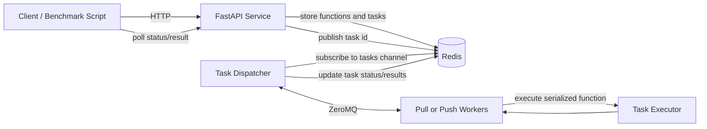

# Distributed Function-as-a-Service Platform

A distributed Function-as-a-Service (FaaS) platform built with Python, FastAPI, Redis, and ZeroMQ. The system lets clients register Python functions, submit serialized function invocations, execute those tasks through one of several dispatcher modes, and retrieve task status or results through a REST API.

This project was developed for MPCS 52040 Distributed Systems and demonstrates local multiprocessing, worker-driven scheduling, dispatcher-driven scheduling, Redis-backed task state, and heartbeat-based fault tolerance.

## Features

- **Function registration and invocation** through a FastAPI web service.
- **Three execution modes**:
  - **Local mode**: the dispatcher executes tasks using a local multiprocessing pool.
  - **Pull mode**: workers repeatedly request tasks from the dispatcher.
  - **Push mode**: workers register with the dispatcher, and the dispatcher assigns tasks to them.
- **Redis-backed storage** for functions, tasks, status transitions, task results, worker heartbeats, and task notifications.
- **ZeroMQ communication** between the dispatcher and distributed workers.
- **Fault tolerance** through worker heartbeat monitoring and task re-queuing when workers fail.
- **Dill-based serialization** for Python functions, arguments, return values, and exceptions.
- **Benchmark tooling** for weak-scaling experiments, throughput measurement, latency measurement, and visualization.
- **Automated tests** for API behavior, dispatcher-worker integration, state transitions, concurrent execution, and failure recovery.

## Architecture

The platform is organized around four main components:



### Component Responsibilities

- `service/main.py` exposes the REST API.
- `service/redis_client.py` stores registered functions and task metadata in Redis.
- `service/serialize.py` serializes and deserializes Python objects using `dill` and base64.
- `task_dispatcher.py` listens for new tasks and dispatches work in local, pull, or push mode.
- `worker_pool/pull_worker.py` requests tasks from a pull-mode dispatcher.
- `worker_pool/push_worker.py` registers with a push-mode dispatcher and waits for assigned tasks.
- `worker_pool/executor.py` deserializes functions and parameters, executes the function, and serializes the result.
- `benchmark/performance_client.py` runs benchmark sweeps across execution modes.
- `benchmark/plot_results.py` creates plots from benchmark CSV output.

## Execution Modes

### Local Mode

Local mode is the simplest execution mode. The dispatcher subscribes to the Redis task channel and executes tasks using a local process pool.

Use this mode when you want to test the API, Redis integration, serialization, and task lifecycle without running separate worker processes.

### Pull Mode

Pull mode uses a ZeroMQ `REP` socket in the dispatcher and `REQ` sockets in workers. Workers send `REQUEST_TASK` messages, receive a task when one is available, execute it, and send the result back to the dispatcher.

This mode is worker-driven and works well when workers should control when they accept more work.

### Push Mode

Push mode uses a ZeroMQ `ROUTER` socket in the dispatcher and `DEALER` sockets in workers. Workers register with the dispatcher, and the dispatcher assigns queued tasks to known workers in round-robin order.

This mode is dispatcher-driven and is useful for comparing centralized scheduling behavior against pull-based scheduling.

## Prerequisites

- Python 3.12 or newer
- Redis server
- Conda, `venv`, or another Python environment manager
- PowerShell, WSL2, Linux, or macOS terminal

Redis must be reachable at:

```text
localhost:6379
```

The current Redis connection settings are defined in `service/redis_client.py`.

## Installation

### 1. Clone the Repository

```bash
git clone <your-repository-url>
cd <project-directory>
```

### 2. Create a Python Environment

Using Conda:

```bash
conda create -n mpcsfaas python=3.12
conda activate mpcsfaas
```

Using `venv`:

```bash
python -m venv .venv
```

On PowerShell:

```powershell
.\.venv\Scripts\Activate.ps1
```

On Linux, macOS, or WSL2:

```bash
source .venv/bin/activate
```

### 3. Install Python Dependencies

Install the runtime and test dependencies:

```bash
pip install fastapi uvicorn redis dill pyzmq pydantic requests pytest pandas matplotlib numpy
```

If you later add a `requirements.txt`, the equivalent setup command is:

```bash
pip install -r requirements.txt
```

### 4. Install and Start Redis

On Ubuntu, Debian, or WSL2:

```bash
sudo apt update
sudo apt install redis-server
sudo service redis-server start
```

On macOS with Homebrew:

```bash
brew install redis
brew services start redis
```

Using Conda:

```bash
conda install -c conda-forge redis
redis-server
```

Verify Redis is running:

```bash
redis-cli ping
```

Expected output:

```text
PONG
```

## Quick Start

Open separate terminals for Redis, the FastAPI service, the dispatcher, and any workers.

### 1. Start Redis

```bash
redis-server
```

If Redis is already running as a service, verify it instead:

```bash
redis-cli ping
```

### 2. Start the FastAPI Service

Because `service/main.py` imports sibling modules directly, include the `service` directory in `PYTHONPATH` when starting from the project root.

PowerShell:

```powershell
$env:PYTHONPATH = "$PWD\service;$PWD"
python -m uvicorn service.main:app --reload
```

Linux, macOS, or WSL2:

```bash
PYTHONPATH=service:. python -m uvicorn service.main:app --reload
```

The API will be available at:

```text
http://127.0.0.1:8000
```

Interactive API documentation is available at:

```text
http://127.0.0.1:8000/docs
```

### 3. Start a Dispatcher

Choose one execution mode.

Local mode:

```bash
python task_dispatcher.py -m local -w 4
```

Pull mode:

```bash
python task_dispatcher.py -m pull -p 5001
```

Push mode:

```bash
python task_dispatcher.py -m push -p 5002
```

### 4. Start Workers

Workers are only needed for pull and push modes.

Pull worker:

```bash
python -m worker_pool.pull_worker -H localhost -p 5001 -w 2
```

Push worker:

```bash
python -m worker_pool.push_worker -H localhost -p 5002 -w 2
```

You can start multiple worker processes in separate terminals to increase worker capacity.

## API Usage

### Register and Execute a Function

The API expects serialized functions and serialized argument payloads. A parameter payload should serialize a tuple of:

```python
(args, kwargs)
```

Example client:

```python
import time
import requests
from service.serialize import serialize, deserialize

API = "http://127.0.0.1:8000"


def double(x):
    return x * 2


# Register the function.
register_response = requests.post(
    f"{API}/register_function",
    json={
        "name": "double",
        "payload": serialize(double),
    },
)
register_response.raise_for_status()
function_id = register_response.json()["function_id"]

# Submit a task.
execute_response = requests.post(
    f"{API}/execute_function",
    json={
        "function_id": function_id,
        "payload": serialize(((21,), {})),
    },
)
execute_response.raise_for_status()
task_id = execute_response.json()["task_id"]

# Poll for the result.
while True:
    result_response = requests.get(f"{API}/result/{task_id}")
    result_response.raise_for_status()
    task = result_response.json()

    if task["status"] == "COMPLETED":
        print(deserialize(task["result"]))
        break

    if task["status"] == "FAILED":
        raise RuntimeError(deserialize(task["result"]))

    time.sleep(0.1)
```

Expected output:

```text
42
```

## API Reference

### `POST /register_function`

Registers a serialized Python function.

Request body:

```json
{
  "name": "double",
  "payload": "<base64 dill payload>"
}
```

Response body:

```json
{
  "function_id": "uuid"
}
```

### `POST /execute_function`

Creates a task for a registered function.

Request body:

```json
{
  "function_id": "uuid",
  "payload": "<base64 dill payload of (args, kwargs)>"
}
```

Response body:

```json
{
  "task_id": "uuid"
}
```

### `GET /status/{task_id}`

Returns the current status for a task.

Response body:

```json
{
  "task_id": "uuid",
  "status": "QUEUED | RUNNING | COMPLETED | FAILED"
}
```

### `GET /result/{task_id}`

Returns task status and the serialized result if one is available.

Response body:

```json
{
  "task_id": "uuid",
  "status": "QUEUED | RUNNING | COMPLETED | FAILED",
  "result": "<base64 dill payload or null>"
}
```

## Task Lifecycle

Tasks move through the following states:

```text
QUEUED -> RUNNING -> COMPLETED
QUEUED -> RUNNING -> FAILED
```

When a task is created, it is stored in Redis and published to the Redis `tasks` channel. The dispatcher receives the task ID, marks the task as running when it assigns or starts execution, and stores the serialized result or serialized exception when execution finishes.

## Fault Tolerance

Workers write heartbeat timestamps to Redis under the `worker_heartbeats` hash. The dispatcher checks heartbeats and treats workers as dead if they have not updated their heartbeat within the configured timeout.

When a worker is considered dead:

1. The dispatcher finds tasks assigned to that worker.
2. Those tasks are moved back to `QUEUED`.
3. The task IDs are re-published to the Redis task channel.
4. The dead worker's heartbeat and assignment metadata are removed.

The heartbeat timeout is configured in `task_dispatcher.py`:

```python
HEARTBEAT_TIMEOUT = 3
```

## Running Tests

### Web Service Tests

Start Redis, the FastAPI service, and a dispatcher before running end-to-end web service tests.

Example with local mode:

```bash
redis-server
```

```bash
PYTHONPATH=service:. python -m uvicorn service.main:app --reload
```

```bash
python task_dispatcher.py -m local -w 4
```

Then run:

```bash
pytest tests/test_webservice.py -v
```

### Dispatcher and Worker Tests

These tests start dispatcher threads and worker subprocesses directly:

```bash
pytest tests/test_dispatcher_workers.py -v
```

### Full Test Suite

```bash
pytest tests/ -v
```

If tests behave inconsistently after manual runs, clear Redis before retrying:

```bash
redis-cli FLUSHDB
```

## Benchmarking

The benchmark client registers test functions, starts each execution mode, submits tasks, measures latency and throughput, and writes results to CSV.

Make sure Redis and the FastAPI service are already running, then run:

```bash
python benchmark/performance_client.py
```

The benchmark writes:

```text
benchmark/benchmark_results.csv
```

The benchmark currently evaluates:

- Modes: `local`, `pull`, `push`
- Worker counts: `1`, `2`, `4`, `8`, `16`
- Functions: `nop`, `sleep`
- Metrics: wall-clock time, throughput, mean API latency, and mean execution latency

### Generate Plots

After producing `benchmark/benchmark_results.csv`, run:

```bash
python benchmark/plot_results.py
```

Generated plots include:

- `benchmark/latency_flowchart.png`
- `benchmark/weak_scaling_latency.png`
- `benchmark/function_comparison.png`
- `benchmark/weak_scaling_throughput.png`

## Project Structure

```text
.
├── benchmark/
│   ├── performance_client.py    # Benchmark runner
│   └── plot_results.py          # Benchmark visualizations
├── service/
│   ├── main.py                  # FastAPI application
│   ├── models.py                # Pydantic request/response models
│   ├── redis_client.py          # Redis storage and task state helpers
│   └── serialize.py             # Dill/base64 serialization helpers
├── tests/
│   ├── serialize.py             # Test serialization helper
│   ├── test_dispatcher_workers.py
│   └── test_webservice.py
├── worker_pool/
│   ├── executor.py              # Function execution helper
│   ├── pull_worker.py           # Pull-mode worker
│   └── push_worker.py           # Push-mode worker
└── task_dispatcher.py           # Local, pull, and push dispatchers
```

## Troubleshooting

### Redis Connection Errors

Check whether Redis is running:

```bash
redis-cli ping
```

Start Redis if needed:

```bash
redis-server
```

Clear stale test or task data:

```bash
redis-cli FLUSHDB
```

### FastAPI Import Errors

If the FastAPI service cannot import `models` or `redis_client`, start it with `service` included in `PYTHONPATH`.

PowerShell:

```powershell
$env:PYTHONPATH = "$PWD\service;$PWD"
python -m uvicorn service.main:app --reload
```

Linux, macOS, or WSL2:

```bash
PYTHONPATH=service:. python -m uvicorn service.main:app --reload
```

### Port Already in Use

Default ports used by this project:

- FastAPI: `8000`
- Redis: `6379`
- Pull dispatcher: `5001`
- Push dispatcher: `5002`

On Linux, macOS, or WSL2:

```bash
lsof -i :8000
lsof -i :5001
lsof -i :5002
```

On PowerShell:

```powershell
netstat -ano | findstr :8000
netstat -ano | findstr :5001
netstat -ano | findstr :5002
```

### Workers Do Not Receive Tasks

Check the following:

- Redis is running and reachable at `localhost:6379`.
- The dispatcher was started before the workers.
- The worker mode matches the dispatcher mode.
- Pull workers connect to the pull dispatcher port.
- Push workers connect to the push dispatcher port.
- Redis does not contain stale state from a previous run.

### Tasks Stay Queued

This usually means no dispatcher is subscribed to the Redis task channel or no workers are available for the selected mode.

For local mode, confirm the dispatcher is running:

```bash
python task_dispatcher.py -m local -w 4
```

For pull or push mode, confirm both dispatcher and workers are running.

### Clean Shutdown

Stop components in this order:

1. Stop workers with `Ctrl+C`.
2. Stop the dispatcher with `Ctrl+C`.
3. Stop the FastAPI service with `Ctrl+C`.
4. Stop Redis if you started it manually.

Optional Redis shutdown:

```bash
redis-cli shutdown
```

## Development Notes

- Functions and arguments must be serializable by `dill`.
- Function argument payloads must serialize `(args, kwargs)`.
- Results and exceptions are serialized before being stored in Redis.
- Worker processes use a process pool on Unix-like systems and a thread-backed pool on Windows.
- Redis state is not automatically cleared between manual runs.
- The benchmark script starts and stops dispatchers and workers, but it expects Redis and the FastAPI service to already be available.

## License

This project is part of MPCS 52040 Distributed Systems coursework.
