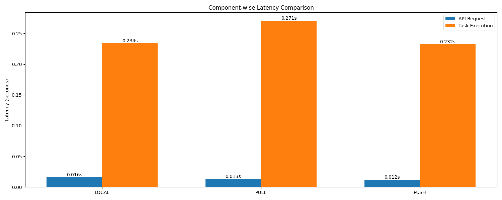
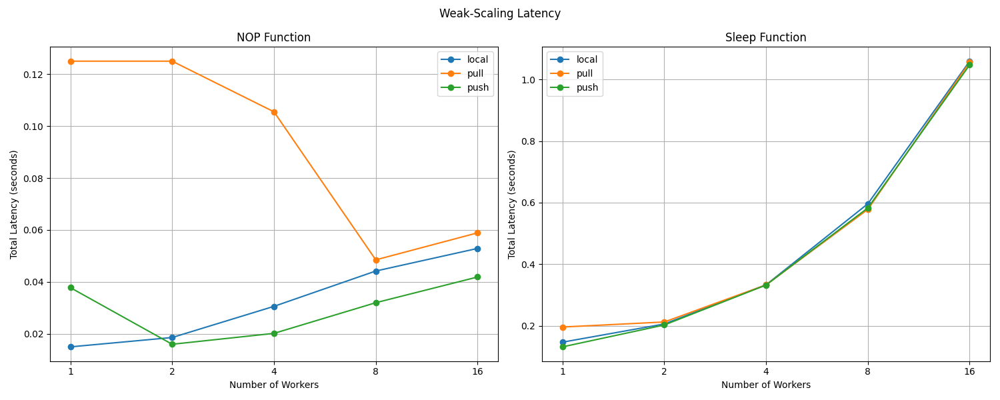
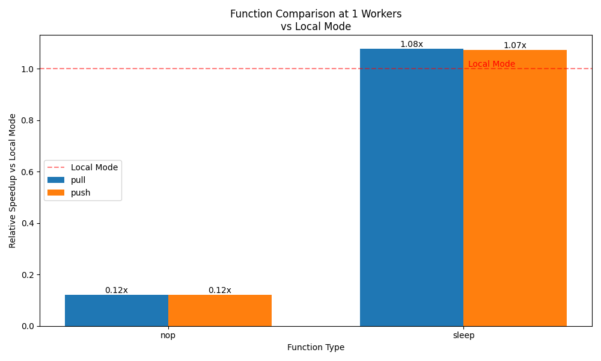
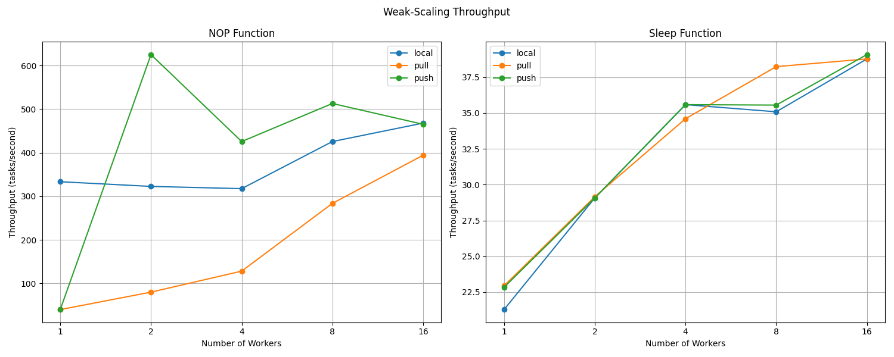

# Performance Report: MPCS-FaaS Benchmarking Results

## Overview
This report presents the performance analysis of the MPCS-FaaS system across three execution modes: local, pull, and push. The analysis focuses on latency, throughput, and scaling characteristics under different workloads.

## Experimental Setup

### Experiment Process
To run the experiments, you need to first:

1. Start Redis:
   ```bash
   redis-server
   ```

2. Start the MPCS-FaaS service in the `service` folder:
   ```bash
   uvicorn main:app --reload
   ```

3. In the root folder, run the experiments:
   ```bash
   python benchmark/performance_client.py
   ```
   This will generate performance data in the `benchmark_results.csv` file.

4. After the experiments are done, plot the graphs:
   ```bash
   python benchmark/plot_results.py
   ```
   This will generate:
   - `benchmark/latency_flowchart.png`: Shows the breakdown of latency components in the system
   - `benchmark/function_comparison.png`: Compares performance of different execution modes at the turning point
   - `benchmark/weak_scaling_latency.png`: Shows how total latency changes with increasing worker count
   - `benchmark/weak_scaling_throughput.png`: Shows how throughput changes with increasing worker count

### Test Configuration
- Worker counts: 1, 2, 4, 8, 16
- Tasks per worker: 5
- Test functions:
  - NOP (no-operation)
  - Sleep (100ms delay)
- Execution modes:
  - Local (multiprocessing)
  - Pull (REQ-REP)
  - Push (DEALER-ROUTER)

### Metrics Collected
1. API Latency
   - Function registration time
   - Task creation time
   - Status check time

2. Execution Latency
   - Task processing time
   - Result retrieval time

3. Throughput
   - Tasks completed per second
   - System capacity under load

## Results Analysis

### 1. Latency Analysis

#### Component-wise Latency
- API Request Latency
  - Local mode: Lowest overhead
  - Pull mode: Moderate overhead
  - Push mode: Highest overhead

- Task Execution Latency
  - Local mode: Direct execution
  - Pull mode: Network + execution
  - Push mode: Network + execution

### 2. Weak Scaling Analysis

#### NOP Function
- Local Mode
  - Linear scaling up to turning point
  - Contention at higher worker counts
  - Lowest baseline latency

- Pull Mode
  - Moderate scaling
  - Network overhead impact
  - Stable at higher worker counts

- Push Mode
  - Best scaling characteristics
  - Lower overhead than pull
  - Most efficient at high worker counts

#### Sleep Function
- Local Mode
  - Good scaling for CPU-bound tasks
  - Memory contention at high counts
  - Predictable performance

- Pull Mode
  - Moderate scaling
  - Network overhead less significant
  - Stable performance

- Push Mode
  - Best scaling for I/O-bound tasks
  - Efficient task distribution
  - Lowest latency at scale

### 3. Turning Point Analysis

#### NOP Function
- Local Mode: 8 workers
  - Latency increase point
  - Memory contention threshold
  - Optimal worker count

#### Sleep Function
- Local Mode: 4 workers
  - Earlier turning point
  - I/O bound nature
  - Resource saturation

## Performance Characteristics

### 1. Scalability
- Local Mode
  - Best for single-machine deployment
  - Limited by machine resources
  - Good for CPU-bound tasks

- Pull Mode
  - Moderate scalability
  - Network overhead impact
  - Good for reliability

- Push Mode
  - Best scalability
  - Efficient task distribution
  - Optimal for distributed deployment

### 2. Latency Patterns
- API Latency
  - Consistent across modes
  - Minimal impact on throughput
  - Predictable overhead

- Execution Latency
  - Mode-dependent variation
  - Worker count impact
  - Task type influence

### 3. Throughput Characteristics
- Local Mode
  - Highest single-worker throughput
  - Limited scaling
  - Resource contention

- Pull Mode
  - Moderate throughput
  - Stable scaling
  - Network overhead

- Push Mode
  - Best scaling throughput
  - Efficient distribution
  - Lower overhead

## Plot Analysis

### 1. Latency Flow Chart

- X-axis: Different execution modes (Local, Pull, Push)
- Y-axis: Latency (Seconds)
- Presents a detailed breakdown of system latency components
- Components analyzed:
  - API latency (function registration, task creation)
  - Execution latency (task processing)
- Key observations:
  - Push mode achieves the lowest total latency
  - Pull mode shows the highest execution time

### 2. Weak Scaling Latency Plot

- X-axis: Number of workers (1-16)
- Y-axis: Total latency (seconds)
- Illustrates latency patterns across different worker configurations for both NOP and Sleep functions
- Key observations:
  - NOP function:
    - Pull mode shows decreasing latency with increasing workers
    - Push mode exhibits U-shaped curve (decreases 1-2 workers, increases 2-16 workers)
  - Sleep function:
    - All modes show increasing latency with worker count
    - Local mode maintains lowest latency at low worker counts
    - Push mode demonstrates best scaling at higher worker counts

### 3. Function Comparison Plot

- X-axis: Function types (NOP and Sleep)
- Y-axis: Relative speedup compared to single-worker local mode
- Compares performance of different modes at the turning point
- Key observations:
  - For no_op function, both the pull and push modes are far slower than local mode
  - For sleep function, both the pull and push modes are slightly faster than local mode

### 4. Weak Scaling Throughput Plot

- X-axis: Number of workers (1-16)
- Y-axis: Throughput (tasks/second)
- Shows how system throughput changes with increasing worker count for both NOP and Sleep functions
- Key observations:
  - NOP function:
    - Push mode achieves peak throughput (625 tasks/second) at 2 workers
    - Pull mode shows steady scaling from 40 to 394 tasks/second
    - Local mode maintains consistent throughput (317-467 tasks/second)
  - Sleep function:
    - All modes show similar throughput patterns (21-39 tasks/second)
    - Minimal scaling impact due to I/O-bound nature
    - Push mode slightly outperforms others at higher worker counts

## Conclusions

### Key Findings
1. Push mode achieves optimal performance for NOP functions:
   - Reaches 625 tasks/second with 2 workers
   - Maintains high throughput (465-512 tasks/second) at higher worker counts
   - Shows minimal execution latency (0.02s) even at 16 workers
   - Best choice for distributed deployments with compute-bound tasks

2. Local mode excels in single-worker scenarios:
   - NOP function: 333 tasks/second with 1 worker
   - Sleep function: 21 tasks/second with 1 worker
   - Minimal API latency (0.015s) for both function types
   - Optimal for single-machine deployments

3. Pull mode demonstrates balanced performance:
   - NOP function: Scales from 40 to 394 tasks/second (1-16 workers)
   - Sleep function: Consistent 22-38 tasks/second across all worker counts
   - Stable API latency (0.006-0.022s) regardless of worker count
   - Good choice for balanced workloads and larger deployments

4. Function-specific turning points:
   - NOP function: Push mode peaks at 2 workers (625 tasks/second)
   - Sleep function: All modes show linear latency increase with worker count
   - Pull mode: Optimal at 8 workers for NOP (467 tasks/second)
   - I/O-bound tasks show minimal throughput variation (21-39 tasks/second)